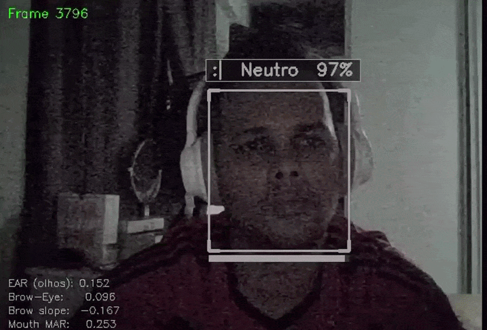

# BioFace AI

**Análise comportamental em tempo real via reconhecimento facial e detecção de emoções — offline, sem cloud, sem custo recorrente.**



Empresas pagam caro para saber como pessoas reagem. Nielsen cobra por pesquisa de gôndola. Consultorias de UX cobram por teste de usabilidade. Plataformas de e-learning não sabem se o aluno entendeu ou só ficou olhando para a tela.

O BioFace AI resolve isso com uma webcam comum e código aberto: identifica quem está presente, detecta o que está sentindo e registra tudo localmente — sem enviar um pixel para fora do seu servidor.

[](https://www.python.org/)
[](LICENSE)
[]()

---

## Aplicações reais com mercado

### RH e Treinamentos Corporativos
Integre no onboarding ou em treinamentos e transforme percepção em dado.
"Quantos funcionários ficaram confusos nessa parte?" deixa de ser opinião e vira métrica — sem interromper ninguém, sem formulário, sem viés de resposta.

### Educação
O professor recebe um relatório pós-aula: *"30% dos alunos demonstraram confusão entre 14h e 14h20"*.
Sem câmera invasiva, sem interrupção, sem perguntar nada. A expressão fala sozinha.

### UX Research
Teste a reação emocional de usuários a interfaces, protótipos e produtos físicos sem precisar perguntar como se sentiram.
O rosto registra o que a resposta de formulário esconde.

### Varejo e PDV
Meça a reação de clientes a gôndolas, embalagens e promoções em tempo real.
É exatamente o que empresas como Nielsen cobram caro para fazer — aqui é open-source, roda no seu hardware e os dados ficam com você.

### Controle de Acesso e Presença
Reconhecimento facial para controle de ponto, acesso a ambientes e monitoramento de presença — sem cartão, sem senha, sem fricção.

---

## Por que não usar uma API de nuvem?

| | BioFace AI | APIs de nuvem (AWS Rekognition, Azure Face) |
|--|--|--|
| Custo | Gratuito | Por requisição — escala com volume |
| Privacidade | Dados ficam no seu servidor | Rostos e emoções enviados para terceiros |
| Offline | Sim — funciona sem internet | Não |
| Customizável | Código aberto, modifique o que quiser | Caixa preta |
| Latência | ~40ms local | 200ms+ (depende da rede) |
| LGPD / GDPR | Você controla os dados | Depende do contrato com o provedor |

---

## Performance

Medido em CPU Intel i5, 8GB RAM, webcam 720p, iluminação normal:

| Métrica | Valor |
|---------|-------|
| FPS (pipeline leve) | 25–30 FPS |
| Latência de detecção | ~40ms por frame |
| Latência de reconhecimento | +15ms (busca no banco) |
| Latência da API (health check) | < 10ms |
| Uso de RAM (pipeline) | ~300–500 MB |
| Acurácia de emoções (ONNX FER+) | ~72% em condições normais |
| Tamanho do modelo ONNX | 30 MB |

> Acurácia de emoções medida informalmente com expressões frontais e boa iluminação. Raiva e surpresa têm boost adicional via análise geométrica de landmarks.

---

## O que faz

- Detecta faces em tempo real (MediaPipe, 468 landmarks)
- Reconhece e identifica pessoas cadastradas via embeddings faciais (128D, distância cosseno)
- Classifica 5 emoções: Feliz, Triste, Raiva, Surpresa, Neutro
- Registra histórico de presenças e emoções em SQLite
- Expõe API REST + WebSocket (FastAPI) para integração com outros sistemas
- Dashboard web (Streamlit) com gráficos e gerenciamento de usuários

---

## Arquitetura

O pipeline de câmera roda no host. API e Dashboard rodam em Docker.

```
Host (Windows / Linux / Mac)
└── main-light.py
      Webcam → MediaPipe (468 landmarks)
            → FaceRecognizer (embedding 128D)
            → EmotionClassifierONNX (FER+ + geométrico)
            → SQLite
            → HTTP POST → API

Docker Compose
├── bioface-api        → http://localhost:8000/docs  (FastAPI)
└── bioface-dashboard  → http://localhost:8501       (Streamlit)
```

> Docker no Windows não acessa webcam diretamente — por isso o pipeline fica no host. Veja [docs/ARQUITETURA_HIBRIDA.md](docs/ARQUITETURA_HIBRIDA.md).

---

## Instalação e execução

### Modo 1 — Standalone (só pipeline, sem Docker)

Use quando quiser apenas reconhecimento facial e emoções, sem API nem Dashboard.

```bash
# 1. Clone e entre na pasta
git clone https://github.com/jonasferreira-silva1/bioface-ai.git
cd bioface-ai

# 2. Crie e ative o ambiente virtual
python -m venv venv
venv\Scripts\activate        # Windows
# source venv/bin/activate   # Linux/Mac

# 3. Instale as dependências
pip install -r requirements-light.txt

# 4. Execute — a janela da câmera abre automaticamente
python main-light.py
```

> Na primeira execução o modelo ONNX (~30 MB) é baixado automaticamente para `models/`. Aguarde o download antes da janela abrir.

---

### Modo 2 — Híbrido (pipeline + API + Dashboard)

Requer Docker instalado. São **3 passos obrigatórios em ordem**.

**Passo 1 — Sobe API e Dashboard em Docker** (aguarde até ver "Application startup complete")

```bash
docker-compose up --build
```

**Passo 2 — Em outro terminal, inicia o pipeline de câmera**

```bash
# Ative o venv primeiro (se ainda não estiver ativo)
venv\Scripts\activate

python main-light.py --api-url http://localhost:8000
```

**Passo 3 — Acesse no browser** (só funcionam após o Passo 1 estar rodando)

| Serviço | URL | O que é |
|---------|-----|---------|
| API + Swagger | http://localhost:8000/docs | Documentação interativa dos endpoints |
| Dashboard | http://localhost:8501 | Interface web com gráficos e usuários |

> ⚠️ As URLs acima **não funcionam** se o `docker-compose up` não estiver rodando. Elas ficam disponíveis apenas enquanto os containers estão ativos.

---

## Uso rápido

```bash
# Cadastrar pessoa
python scripts/register_face.py --name "Jonas Silva"

# Listar cadastrados
python scripts/list_all_users.py

# Testar detecção de emoções isoladamente
python scripts/test_emotion_detection.py
```

---

## Stack

| Camada | Tecnologia | Por quê |
|--------|-----------|---------|
| Detecção facial | MediaPipe Face Mesh | Leve, sem GPU, 468 landmarks |
| Reconhecimento | Embeddings 128D + cosseno | Sem TensorFlow, ~15ms |
| Emoções | ONNX Runtime (FER+) | 30MB, sem TensorFlow, ~25ms |
| Banco de dados | SQLite + SQLAlchemy | Zero configuração, portável |
| API | FastAPI + WebSocket | Async, Swagger automático |
| Dashboard | Streamlit + Plotly | Rápido de construir, interativo |
| Containers | Docker + Compose | Isolamento, deploy simples |
| Logging | Loguru | Rotação automática, colorido |

---

## Estrutura

```
bioface-ai/
├── src/
│   ├── ai/              # Reconhecimento + classificação de emoções (ONNX)
│   ├── api/             # FastAPI — rotas REST, WebSocket
│   ├── dashboard/       # Dashboard Streamlit
│   ├── database/        # Modelos SQLAlchemy + repositório
│   ├── vision/          # Câmera, detector, processador de faces
│   ├── utils/           # Config (Pydantic Settings) + Logger (Loguru)
│   ├── exceptions.py    # Hierarquia de exceções customizadas
│   └── main_light.py    # Pipeline principal
├── scripts/             # Cadastro, diagnóstico, limpeza de dados
├── tests/               # 46 testes com Pytest
├── docs/                # Instalação, uso, arquitetura, troubleshooting
├── models/              # Modelo ONNX (baixado automaticamente)
├── main-light.py        # Ponto de entrada
├── run_api.py           # Inicia API localmente (sem Docker)
├── docker-compose.yml
├── Dockerfile.api
└── Dockerfile.dashboard
```

---

## Testes

```bash
pytest tests/ -v
# 46 passed
```

---

## Documentação

| Documento | Conteúdo |
|-----------|----------|
| [docs/INSTALL.md](docs/INSTALL.md) | Instalação detalhada e configuração |
| [docs/USAGE.md](docs/USAGE.md) | Como usar, scripts disponíveis, API |
| [docs/ARQUITETURA_HIBRIDA.md](docs/ARQUITETURA_HIBRIDA.md) | Diagrama e decisões de arquitetura |
| [docs/TROUBLESHOOTING.md](docs/TROUBLESHOOTING.md) | Problemas comuns e soluções |

---

## Próximas features

- Rastreamento simultâneo de múltiplas faces
- Análise de micro-expressões
- Alertas configuráveis (webhook quando pessoa específica é detectada)
- Export de relatórios de presença em CSV/PDF

---

## Autor

**Jonas Ferreira da Silva**
- GitHub: [@jonasferreira-silva1](https://github.com/jonasferreira-silva1)
- LinkedIn: [jonas-silva01](https://www.linkedin.com/in/jonas-silva01/)

---

## Licença

MIT — veja [LICENSE](LICENSE).
